# Proof of Authority Development Blockchain

The first step as a blockchain enthusiast is to set up a private testnet that you and your colleagues or team members 
can use to explore potentials for blockchain.

This project aims to set up a testnet blockchain as a sandbox blockchaain to try explore what this technology can bring to fruition.

In order to set up a testnet, We will need to use the following tools and utilities:

* Puppeth, to generate your genesis block.

* Geth, a command-line tool, to create keys, initialize nodes, and connect the nodes together.

* MyCrypto Tool, an open-source, client-side tool for generating ether wallets and send/receive test Coins/tokens.

## Pre Requisite Installations

* MyCrypto is a free, open-source, client-side interface that allows you to interact directly with the blockchain.
* download the verson speccfic to your Operating System from https://download.mycrypto.com/ and follow the wizard steps which is self explanatory
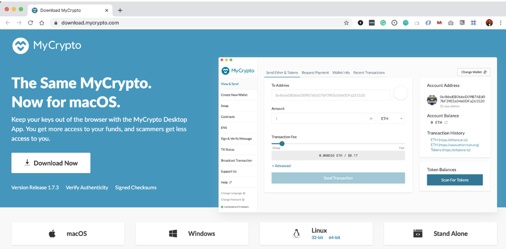

* Go Ethereum Tools to create our very own blockchain, from the genesis block to mining tokens and making transactions.
* Navigate to the Go Ethereum Tools download page at https://geth.ethereum.org/downloads/
* Scroll down to the "Stable Releases" section and proceed depending on your operating system.
* Click on the "Geth & Tools 1.9.7" to download the applications bundle archive.
* After downloading the tools archive, open your "Downloads" folder, locate the file called geth-alltools-windows-amd64-1.9.7-a718daa6.zip
* Decompress the archive in the location of your preference in your computer's hard drive, and rename the containing folder as Blockchain-Tools. 
* This will bring the commandline tools puppeth and geth which are part of the Go Ethereum package.

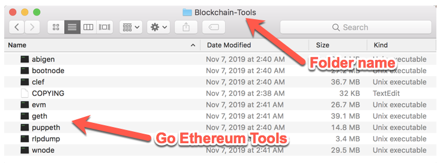

## Setup the custom out-of-the-box blockchain

### Creating network nodes

* Using commandline interface of Go Ethereum tool (geth) we will create two nodes with a separate `datadir` for each using `geth`., say node1 and node 2 in our custome test network. This step will create the address of the keys for these nodes and in each of the node directories a key store file gets created. We will use this keystore file to access our Wallet on MyCrypto.

#### Code: Run the below commands on powershell one after the other. Exlcude the quotation marks. Make note of the addresses in a notepad. We will use them to pre-fund the accounts.

* "./geth account new --datadir poa_testnet/node1"
* "./geth account new --datadir poa_testnet/node2"

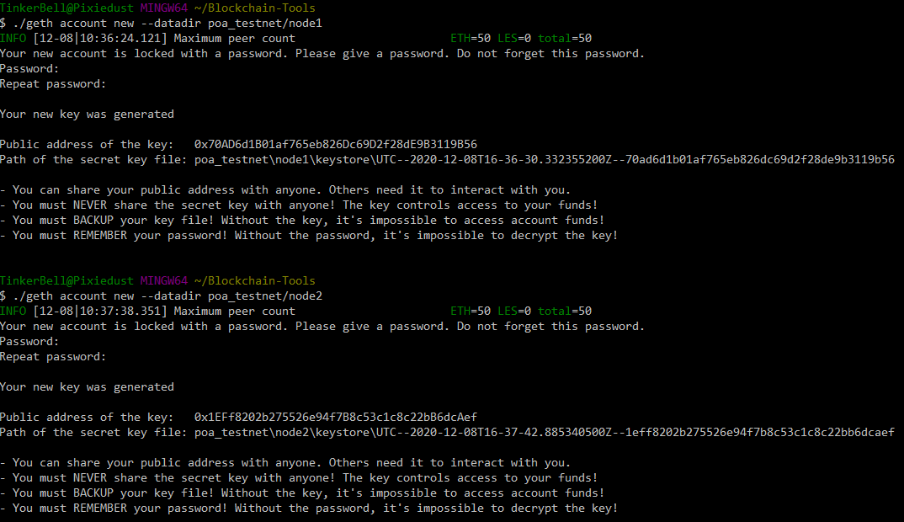

### Creating Genesis Block

* Create a Genesis block using puppeth tool which is bundled along with geth in Go Ethereum tool.
* Puppeth tool helps to maintain and install various helper tools for managing and deploying your private blockchain. 
* Running puppeth: Open a Terminal/Command shell and type ./puppeth 
* Run `puppeth`, name your network, and select the option to configure a new genesis block.
* The first thing it’ll ask for is the network name. This is useful for identifying various blockchains if you’re running several on your local machine. We’ll use “poatestnet” here. 

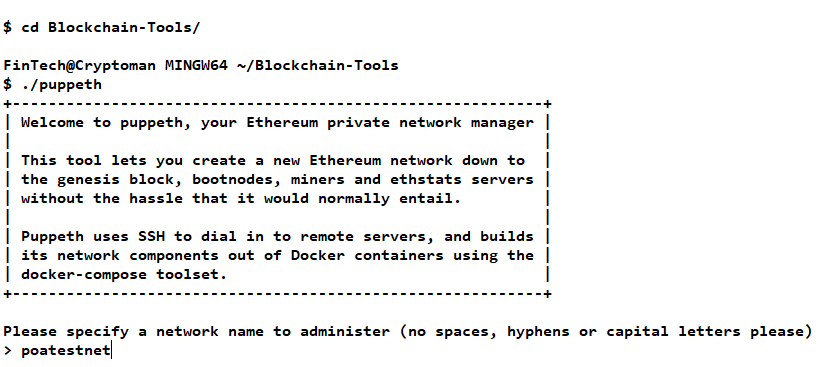

### Configuring Genesis Block
* We will use Proof of Authority as the Concensus Algorithm which allows only specific address to mine /produce a block on the network. 
* Paste both account addresses (node addresses) from the first step one at a time into the list of accounts to seal.
* Paste them again in the list of accounts to pre-fund. There are no block rewards in PoA, so you'll need to pre-fund.
* You can choose `no` for pre-funding the pre-compiled accounts (0x1 .. 0xff) with wei. This keeps the genesis cleaner.
* Complete the rest of the prompts, and when you are back at the main menu, choose the "Manage existing genesis" option.
* Export genesis configurations. This will fail to create two of the files, but you only need `poatestnet.json`.
* You can delete the `poatestnet-harmony.json` file.

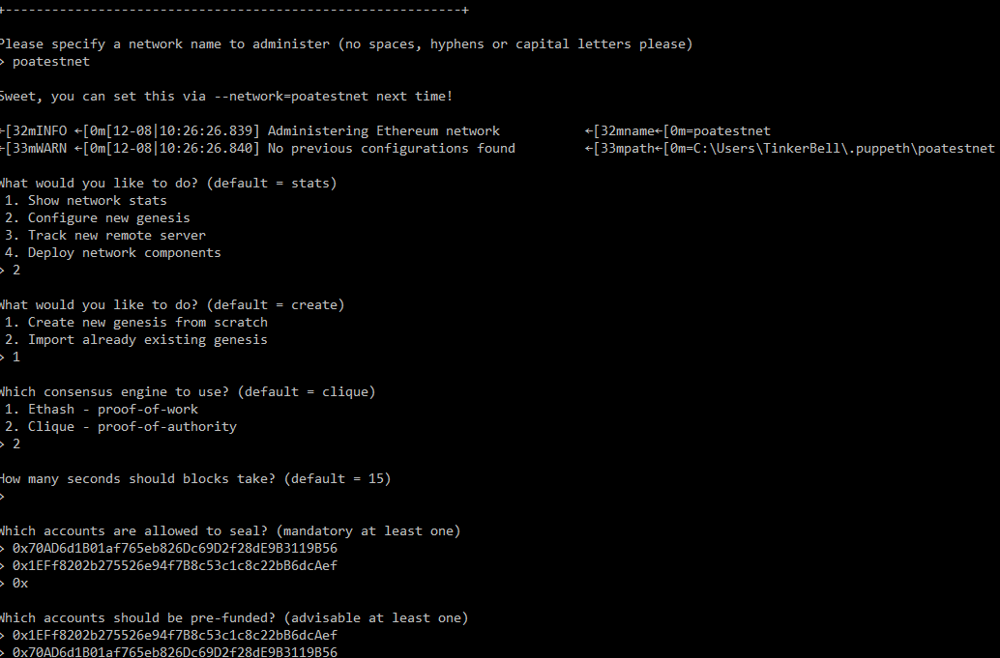

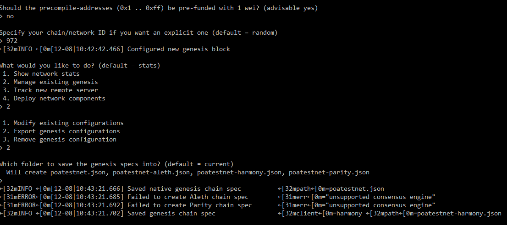

### Initializing and configuring the nodes to mine or produce new blocks

* Initialize each node with the new `networkname.json` with `geth`.

* Code: Run the below commands on powershell once after the other. Exlcude the quotation marks
* "./geth init poatestnet.json --datadir poa_testnet/node1"
* "./geth init poatestnet.json --datadir poa_testnet/node2"
 
* Run the first node, unlock the account, enable mining, and the RPC flag. Only one node needs RPC enabled.
* Code: Setup the first node to mine: Use a seperate powershell window to run this command. Exlcude the quotation marks. use the node1 adddress wihtout 0x
* "./geth --datadir poa_testnet/node1 --unlock "10F997cB675a399845f7DB043F1ACF7737D0b52c" --rpc --allow-insecure-unlock --mine --minerthreads 1"
* once the Node gets initialized and registers network, copy the enode from the powershell window. We will need the enode to boot the 2nd Node using the below commmand

* Set a different peer port for the second node and use the first node's `enode` address as the `bootnode` flag, 'unlock' flag and 'mine' flag. 
* Code: Setup the first node to mine: Use a seperate powershell window to run this command. Exlcude the quotation marks. use the node2 adddress wihtout 0x
* "./geth --datadir poa_testnet/node2 --unlock "A3CfE3131c8bF7AcA05118dF80C4CCB08e7f8029" --allow-insecure-unlock --port 30304 --bootnodes enode://86c9c9435ebc3d97850625bf6348525ad6559c37c62b6a6a709594dee9e818a8493f5152f56318afa3a37ef481386db6d90123d3f315a0cfedcb92949fc72305@127.0.0.1:30303 --ipcdisable --mine --minerthreads 1"
* You should now see both nodes producing new blocks

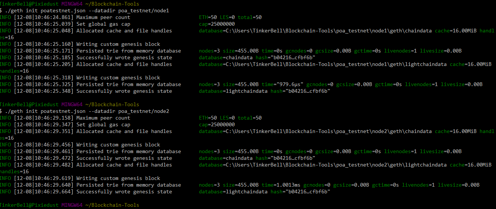

#### Geth flags used in our code:
* --datadir: specifies the Directory where the child nodes configuration and keystore files to be stored or located. 
* --unlock: unlocks the account to access the configuration and keystore for the network. accepts Comma separated list of accounts to unlock
* --port:  Network listening port (default: 30303) 
* --bootnodes: Reference node which is used to run the 2nd node. Uses enode as the address of the primary node. Comma separated enode URLs for P2P discovery bootstrap
* --rpc: Enables the HTTP-RPC server. Repmote procedure call is an inter process communication method triggers the processes/subroutines to execute in another address space.
* --ipcdisable: disables IPC-RPC server. Inter Process Communication method enables communications between multiplease thread of the same processenables communication over RPC instead of IPC. As we will be runnng the network on the same machine with only single minerthread, we disable IPC but use RPC.
* --mine: Enable the node to mine or produce the block
* --minerthreads: # of CPU threads each node can spawn to mine the blocks
* --allow-insecure-unlock: If you access a node with geth via HTTP protocol you can´t unlock account with personal.unlockAccount(web3.eth.account, password). If you try, you'll receive error "account unlock with HTTP access is forbidden". So, to avoid that you have to use the flag allow-insecure-unlock..

* for complete list of Geth Commmands and options, please refer to https://geth.ethereum.org/docs/interface/command-line-options

## Send Test transactions.

Using MyCrypto which is an open-source, client-side tool for generating ether wallets and interacting with the blockchain for development purpose, 
we will connect our local blockchain and import the pre-funded wallets. Mycrypto registers the address enabling us to send and recieve transactions or cryto currencies, just like transacting with real currencies on Ethereum network.
* open  Mycrypto tool and connect to the newly created test network
* Use the MyCrypto GUI wallet to connect to the node with the exposed RPC port.
* You will need to use a custom network, and include the chain ID, and use ETH as the currency.

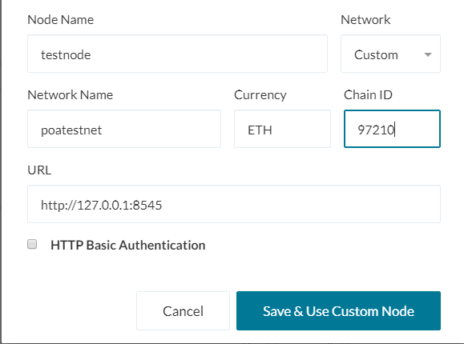

* Once the custom node is created on MyCrypto, select the keystore file option on the home page of crypto tool. Import the keystore file from the `node1/keystore` directory into MyCrypto. This will import the private key.

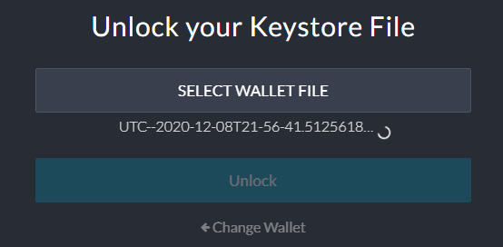

* the account balance will show a large number of tokens which are prefunded into the acccount when creating the Genesis block and configuring the nodes.
* select the Send Ether & Tokens option on the top menu which will open up the transaction initiation page as shown below

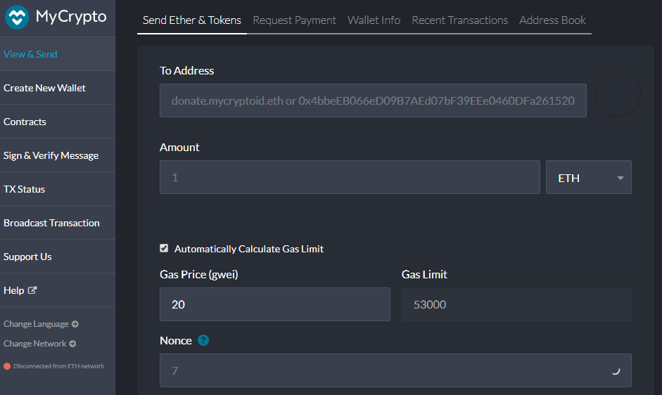

*Enter the number of tokens you want to send to the second node we created in our network and the node address and then submit the transaction
* Send a transaction from the `node1` account to the `node2` account.

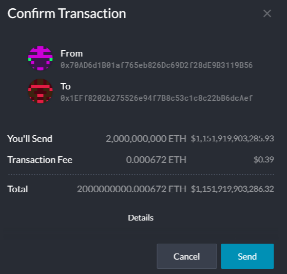

* As both Node11 and node2 in our POATestnet are configured to mine the blocks, The transaction will be confirmed and a transaction hash will be shared once it is mined. 
* Copy the transaction hash and paste it into the "TX Status" section of the app, or click "TX Status" in the popup.

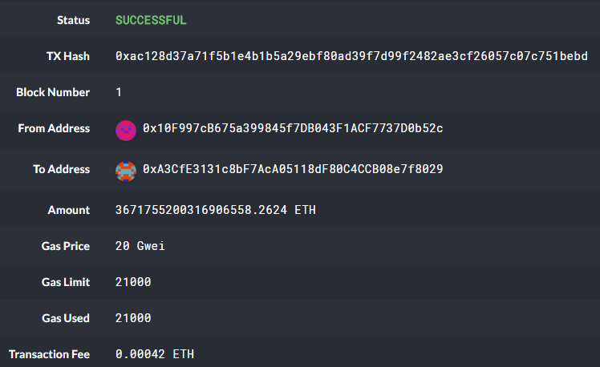

### Remember, *never* share your mainnet private keys! This is a testnet, so coins have no value here!

---
